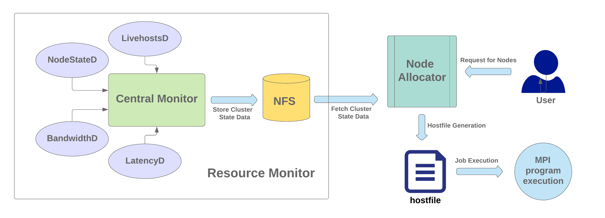

# Network and Load-aware Resource Allocator for Parallel Programs
Distributed-memory parallel programs typically run on multiple nodes in a cluster (shared or dedicated) or a supercomputer. The parallel communication library (e.g. Message Passing Interface) takes care of the communication setup and messaging required for parallel execution. The user is expected to specify a list of nodes while executing a parallel job in an unmanaged cluster. Typically, users randomly select a few nodes without much knowledge about the current network connectivity of these nodes and the current load on these nodes. In this work, we address the problem of allocating a good set of nodes to run the parallel MPI jobs in a non-dedicated cluster with variable resource usages (varying compute load and varying available network bandwidths).

We present a resource broker for MPI jobs in a shared cluster, considering the current compute load and available network bandwidths. MPI programs are generally communication-intensive. Thus the current network availability between the compute nodes impacts performance. Many existing resource allocation techniques mostly consider static node attributes and some dynamic resource attributes. This does not lead to a good allocation in case of shared clusters because the network usage and system load vary significantly at times. We propose a load and network-aware greedy algorithm for resource allocation which incorporated the current network state along with other static and dynamic resource characteristics in our heuristic. Our node allocator is lightweight, low-overhead and runs in a few milliseconds. We tested this on up to 60 heterogeneous nodes of our departmental cluster.  It is able to reduce execution times by more than 38% on average ascompared to the default allocation.

We compare network and load-aware allocation algorithm with random, sequential and load-aware allocation. We experimented on the Intel cluster of the Department of Computer Science and Engineering, Indian Institute of Technology Kanpur. The cluster has a tree-like hierarchical topology with 4 switches. Each switch connects 10--15 nodes using Gigabit Ethernet. We used two Mantevo benchmarks, miniMD and miniFE for performance evaluation of network and load-aware allocation algorithm. MiniMD is a simple, parallel molecular dynamics (MD) mini-application while MiniFE is an proxy application for unstructured implicit finite element codes which sets up a brick-shaped problem domain of hexahedral elements.

This research work is done as a part of the Undergraduate Project, Fall Semester - 2019, under guidance of [Prof. Preeti Malakar](https://www.cse.iitk.ac.in/users/pmalakar/).

## Academic publications
- This work has been accepted at the [12th HiPC Student Research Symposium in Hyderabad, 2019](https://hipc.org/students-research-symposium/) as a poster paper. The poster can be found [here](./hipc_src_poster.pdf) and the full write-up [here](./hipc_srs_writeup.pdf).
- This work has been accepted at [49th International Conference on Parallel Processing - ICPP in  Edmonton, Canada, 2020](https://jnamaral.github.io/icpp20/) as workshop paper. The full text can be found [here](./icpp_paper.pdf).


## Run Configuration and Usage Instruction
Our Project consists of two core components, namely the Resource Monitor (eagle) and Node Allocator.The figure below gives an overall workflow of
these components. Resource Monitor is a distributed monitoring system for cluster. Resource Monitor uses light-weight daemons for periodically updating list of active nodes (livehosts) and node statistics such as CPU load, CPU utilization, memory usage and
network status. Node Allocator allocates nodes based on user request. It considers node attributes and network dynamics. The Node Allocator uses data collected by the Resource Monitor. 

### Eagle :
This consists of a number of daemon programs that keeps running on cluster in background.

 - **LivehostsD** : This runs on one of the cluster node. Periodically checks that for the live nodes in cluster and update the livehost list.
 - **NodeInfo**: Runs on each livehost and fetch node static and dynamic load data.
 - **bwD** : This runs on one of the livehosts. Internally runs a mpi program to calculate pair to pair bandwidth for all livehosts.
 - **ltD** : This also runs on one of the livehosts. Internally runs a mpi program to calculate pair to pair latency for all livehosts.
 - **monitorD**: This Daemon monitors the other Daemon and make sure they are running and if not so launch the required daemons.
##### Setting Up
Eagle uses `~/.eagle` to store all the monitoring information. Follows these steps to set up eagle.
 * Create eagle directory
``` bash
 > mkdir ~/.eagle
```
* 	create `hosts.txt` in `eagle` folder.
```
csews1
csews3
csews4
.
.
.
csews27
csews32
```
##### Starting up
* move to code repository and start monitord. Currently code repo should be in root folder and name should be UGP ( to be make configurable via environment variable).
```bash
> cd code_repo
> python3 eagle/monitor/monitord.py start
```

This will use `~/.eagle/hosts.txt` as nodes in cluster and launch all other daemon i.e `nodeinfod`, `bwd`, `ltd` on required nodes. This will keeps monitoring the daemon, if some daemon is not running, it will restart them.

##### Monitor
To manually check wheather the daeomon and running and if running then on which node. Run the following:
```bash
> cd code_repo
> ./eagle/monitor/globalDaemonStatus.sh  ~/.eagle/hosts.txt 
```
The output would be something like this:
```bash
>
csews1   :: nodeInfoD ::  up  
csews3   :: nodeInfoD ::  up  
.
.
.
csews32   :: nodeInfoD ::  up  
 
Monitord ::  :: csews19  
LiveHostsd ::  :: csews6  
ltd ::  :: csews6  
bwd ::  :: csews3  
```
##### Shut down
To shut the daemon off, stop the monitor daemon, it will kill all the other daemons.
```bash
> cd code_repo
> python3 eagle/monitor/monitord.py stop
```
##### `~/.eagle` directory structure
```
- hosts.txt
- livehosts.txt
- livehosts.txt.stamp
- bw.txt
- bw.txt.stamp
- lt.txt
- lt.txt.stamp
- csews1
	- nodeinfo.txt
	- nodeinfo.txt.stamp
	- nodeinfo.pid
- csews3 (also running bwd)
	- nodeinfo.txt
	- nodeinfo.txt.stamp
	- nodeinfo.pid
	- bwd.log
	- bwd.err
	- bwd.pid
....
....
....
- csews32
	- nodeinfo.txt
	- nodeinfo.txt.stamp
	- nodeinfo.pid
```
### Allocator :
This allocates nodes for user program based on user request using the data provided by eagle. First create the binary and then use it for allocation. To know details of its working read the paper.
```bash
> cd code_repo/allocator/src
> g++ allocator_improved.cpp -o allocator.out
```
use `allocator.out` for resourse allocation. This takes two arguments. One is process count and other is ppn.
```
> ./allocator.out 16 4

Output :
Allocated Nodes
csews3:4
csews11:4
csews7:4
csews9:4
```
This create two hostfile in code calling folder.
- hosts : Network and Load Aware hosts
- comphosts : Load Aware hosts

Use the host file to run mpi programs.
```bash
>  mpiexec -n 16 -hostfile hosts $mpi_program
>  n=32 &&  $allocator/allocator.out $n 4 > log &&  mpiexec -n $n -hostfile hosts $mpi_program
```


